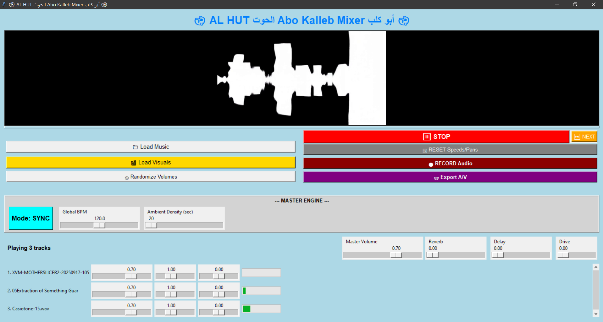

🐋 AL HUT الحوت Abo Kalleb Mixer أبو كلب 🐋

Welcome to AL HUT (الحوت), a real-time audio mixer and visual (VJ) performance tool written in Python. This application allows you to mix multiple audio tracks, apply real-time effects, and sync generative visuals for a live A/V performance.

Features

Multi-Track Audio Mixing: Load and play multiple audio tracks (MP3, WAV, FLAC, etc.) simultaneously.

Real-Time Effects: Apply master effects including Distortion (Drive), Delay, and Reverb.

Two Mixing Modes:

Sync Mode: A BPM-synced mode where tracks wait for the downbeat to start, perfect for rhythmic mixing.

Ambient Mode: A generative, looping mode where tracks fade in and out automatically for continuous ambient soundscapes.

VJ Visual Engine: Load a folder of videos, GIFs, and images to be automatically and randomly played in time with your mix.

Real-Time A/V Export: Record your live performance (both audio and video) to a single .mp4 file using ffmpeg.

Installation

To run this project, you'll need Python 3, ffmpeg, and several Python libraries.

1. FFMPEG:
This application requires ffmpeg to be installed on your system and accessible in your system's PATH.

Windows & Mac: Download from https://ffmpeg.org/download.html

Linux (Ubuntu/Debian): sudo apt update && sudo apt install ffmpeg

2. Python Dependencies:
You can install all the required Python libraries using the included requirements.txt file.

# Clone this repository (or download the ZIP)
git clone [https://github.com/mahmoudismat81/Abo-Kalleb-Mixer.git](https://github.com/mahmoudismat81/Abo-Kalleb-Mixer.git)
cd Abo-Kalleb-Mixer

# Install the required libraries
pip install -r requirements.txt

Usage

Once all dependencies are installed, you can run the application from your terminal:

python abo_kalleb_mixer.py

Click "Load Music" to select a folder containing your audio files.

Click "Load Visuals" to select a folder containing your videos, GIFs, and images.

Click "▶ PLAY" to start the mix.

Use the sliders to control track volume, speed, pan, and master effects.

Click "Export A/V" to start recording your session. Click "FINISH EXPORT" to stop and save the .mp4 file.

Click "⏭ NEXT" to safely stop the current mix and start a new one with new random tracks.

License

This project is licensed under the MIT License. This means you are free to modify, distribute, and use this code for private or commercial use, as long as you include the original copyright notice and license text (see LICENSE file).

Acknowledgements

Creator: Mahmoud Ismail (Al Hut الحوت)

Built with Python, Tkinter, OpenCV, Pedalboard, and SoundDevice.
